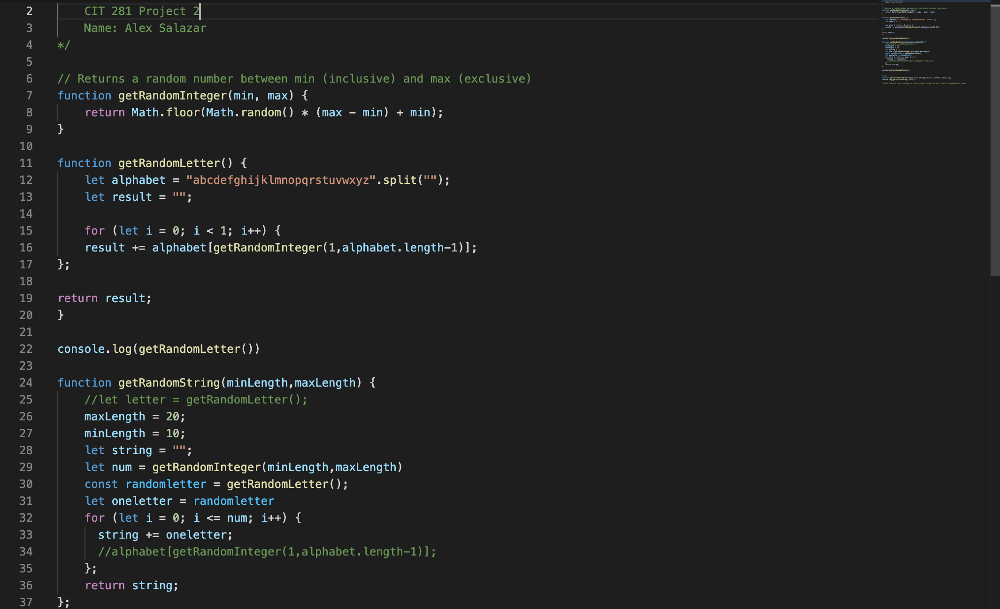

## Welcome to Project 2

This week we learned how to use git to commit, check status and ignore files. As well how to commit on Javascipt.

After completing this project, you will:

Gain experience using git via your CLI and Visual Studio Code (VSCode) Source Control

Gain experience writing and executing non-web server Node.js JavaScript code

Practice refactoring JavaScript code

